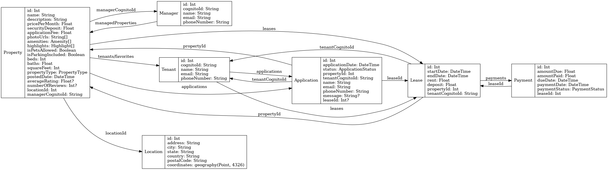

# 🏠 HomeOrbit

A full-stack rental apartment application built with **Next.js**, **Node.js**, and modern web technologies. This project is for learning purposes and demonstrates scalable architecture using only JavaScript and TypeScript tools.

## 📚 Project Status

🛠️ In development — setting up frontend and backend structure.

## 🚀 Tech Stack (Planned)

- **Frontend:** Next.js, Tailwind CSS, Redux Toolkit, Shadcn, TypeScript, React Hook Form, Zod, Framer Motion  
- **Backend:** Node.js, Express.js, PostgreSQL (Supabase or Docker)  
- **Auth:** NextAuth.js or Supabase Auth  
- **File Uploads:** Cloudinary or UploadThing  
- **Deployment:** Vercel (Frontend), Render (Backend)

---

## 📊 Database Schema (ERD)

This ERD shows how Prisma models are related in the backend.

More coming soon...

